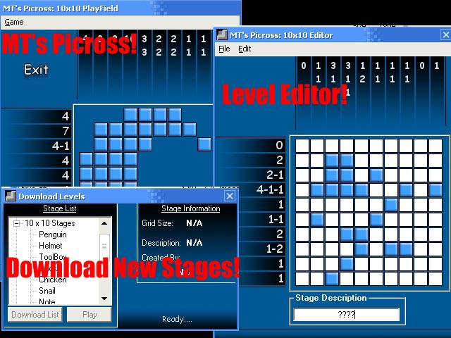



## MT's Picross

### Description

MT's Picross is a puzzle game where you have to use the clues on the outside of the playing field to make up a picture. It includes a tutorial, a level editor and the ability to play new stages online! If you like it, please vote. I've worked pretty hard on this.
 
### More Info
 

             |
---                |---
**Submitted On**   |2003-09-30 20:57:08
**By**             |[MaskingTape](https://github.com/Planet-Source-Code/PSCIndex/blob/master/ByAuthor/maskingtape.md)
**Level**          |Beginner
**User Rating**    |5.0 (50 globes from 10 users)
**Compatibility**  |VB 6\.0
**Category**       |[Games](https://github.com/Planet-Source-Code/PSCIndex/blob/master/ByCategory/games__1-38.md)
**World**          |[Visual Basic](https://github.com/Planet-Source-Code/PSCIndex/blob/master/ByWorld/visual-basic.md)
**Archive File**   |[MT's\_Picro1652389302003\.zip](https://github.com/Planet-Source-Code/maskingtape-mt-s-picross__1-48921/archive/master.zip)

